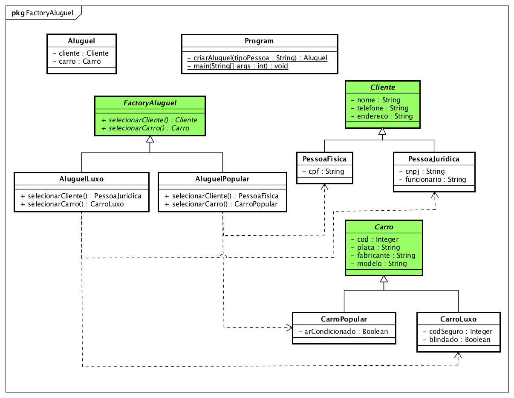

# Abstract Factory

> Implementação do padrão de projeto Abstract Factory.

<p align="center">	
   <a href="https://www.linkedin.com/in/reinaldodiasabreu/">
      
   </a>
   

  <a href="https://github.com/ReinaldoDiasAbreu/AbstractFactory/commits/main">
    
  </a> 
  
  <a href="https://github.com/ReinaldoDiasAbreu/AbstractFactory/stargazers">
    
  </a>
</p>

#### :computer: Tecnologias
Esse projeto foi feito utilizando as seguintes tecnologias:

* [Java 8](https://www.java.com/pt-BR/)      
* [Apache Netbeans](https://netbeans.apache.org/)      

#### :rocket: Funcionalidades

Para exemplificar o funcionamento do padrão de projeto AbstractFactory, foi desenvolvido através dele a regra de negócio de aluguel de carros, onde um aluguel para pessoa física só possuirá carros populares e para pessoa jurídica, somente carros de luxo, criando assim 2 tipos de alugueis.


### Diagrama de Classes Implementado




### Saída de Execução

> Note que para aluguel com pessoa física possuirá somente carros populares, e para pessoa jurídica, sempre carros de luxo.

```
---------- Aluguel Pessoa Física ----------
Aluguel{cliente=Cliente{nome=null, telefone=null, endereco=null  PessoaFisica{cpf=null}}, carro=Carro{cod=null, placa=null, fabricante=null, modelo=null CarroPopular{arCondicionado=null}}}

---------- Aluguel Pessoa Jurídica ----------
Aluguel{cliente=Cliente{nome=null, telefone=null, endereco=null  PessoaJuridica{cnpj=null, funcionario=null}}, carro=Carro{cod=null, placa=null, fabricante=null, modelo=null CarroLuxo{codSeguro=null, blindado=null}}}

```
